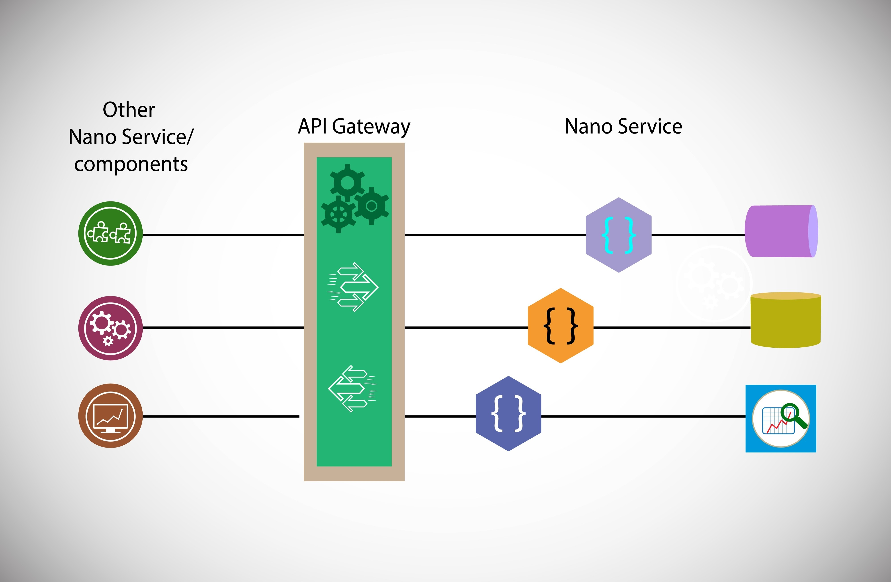
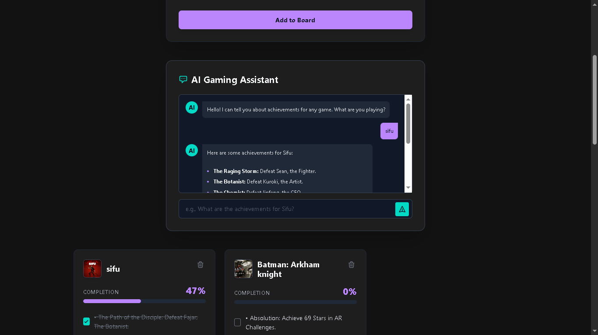

# Game Completion Board

<!--  -->

A full-stack web application designed to track video game progression and achievements. Users can add games, log specific milestones, and visually track their completion percentage through a dynamic, responsive dashboard.

## Features
* **Full CRUD Functionality:** Add, view, update (toggle achievements), and delete games.
* **RESTful API:** A Python/Flask backend handling all database transactions.
* **Dynamic Frontend:** Vanilla JavaScript ES6 handles asynchronous data fetching and real-time DOM manipulation without page reloads.
* **Persistent Storage:** Uses SQLite to safely store user data.
* **Automated Testing:** Includes a Mocha/Chai test suite to verify the accuracy of the progress calculation logic.
* **Custom Styling:** Built from the ground up using SCSS/Sass for a sleek, dark-themed UI.

## Tech Stack
* **Backend:** Python, Flask, SQLite3
* **Frontend:** HTML5, CSS3 (Sass), Vanilla JavaScript ES6
* **Testing:** Mocha, Chai

## Installation & Setup

To run this project locally on your machine:

1. **Clone the repository:**
   git clone https://github.com/samybit/game-completion-board.git
   cd game-completion-board

2. **Set up a Python virtual environment (recommended):**
   python3 -m venv venv
   source venv/bin/activate

3. **Install dependencies:**
   pip install Flask

4. **Run the application:**
   python app.py
   
   The SQLite database (games.db) will be initialized automatically on the first run.

5. **Access the App:**
   * Main App: Open http://127.0.0.1:5000 in your browser.
   * Run Tests: Open http://127.0.0.1:5000/test to view the Mocha test suite.

## Author
* **Samy** - [@samybit](https://github.com/samybit)
